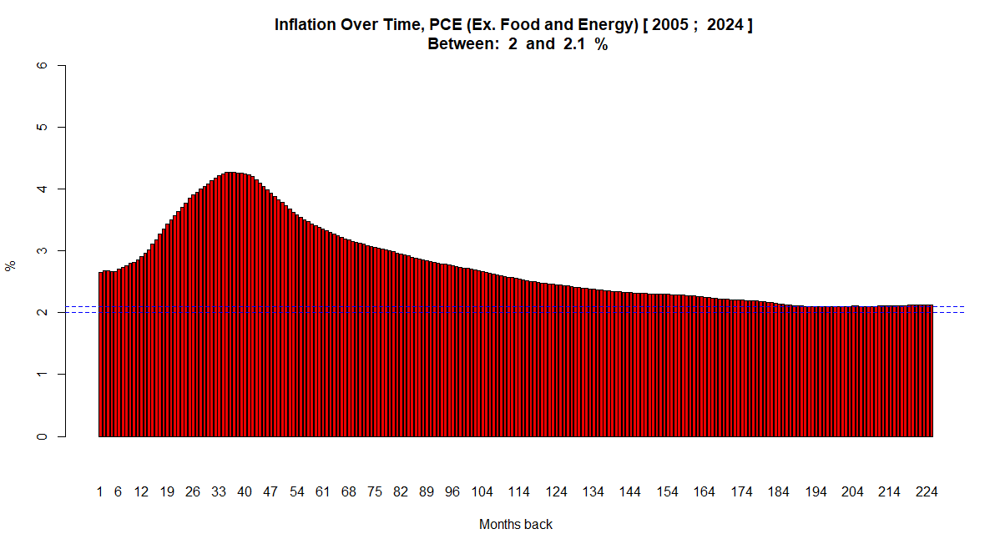

# Inflation over time

This is an R script caluclates the US Inflation over time. 


On August 2020 the Federal Reserve changed their inflation policy to a **Flexible Average Inflation Targeting (FAIT)** policy . See more [here](https://www.clevelandfed.org/publications/economic-commentary/2021/ec-202109-flexible-average-inflation-targeting-reactions)

The new inflation policy seeks to get a inflation rate of 2% over time.

"the statement adopts a flexible inflation averaging strategy that seeks to achieve inflation that averages 2 percent over time in order to ensure longer-term inflation expectations are well anchored at 2 percent" [here](https://www.federalreserve.gov/newsevents/speech/brainard20200901a.htm)

Moreover, the new policy does not define a particular formula to calculate inflation over time

"In seeking to achieve inflation that averages 2 percent over time, we are
not tying ourselves to a particular mathematical formula that defines the average. Thus,
our approach could be viewed as a flexible form of average inflation targeting."[Jerome Powell, August 27, 2020](https://www.federalreserve.gov/newsevents/speech/files/powell20200827a.pdf)


One can therefore assume that, since the Federal Reserve lacks a specific formula, the FOMC might review a past time frame, such as 24 months, to calculate the average inflation for that period. This script aims to replicate that approach by performing a look-back over various time frames (e.g., 1, 2, 10, or 24 months) and determining the average inflation for each

### How to use the script
The script contains a fuction

```
@param : overTime : if TRUE then plot inflation over time, else plot raw data
@param : startYear : start year of the study
@param : endYear : final year of the study
inflation(overTime, startYear, endYear)

# Plots inflation over time from 2005 to 2024
inflation(TRUE,2005, 2025)
```

#### Get The Data
Go to https://fred.stlouisfed.org/series/PCEPILFE to download the PCE data. edit the chart to set the units to `Percent Change from Year Ago` and download the `.csv` file. Make the script point to your downloaded file

```
  table <- read.table([ PATH TO DATA GOES HERE], header = TRUE, sep = ",")
```

Raw plot


Plot for inflation over time



